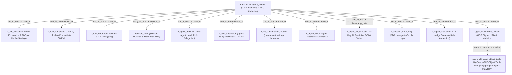

# Google Cloud PSO JAPAC — APO Agent Analytics Looker Block (`pso-agent-analytics-block`)
This Looker Block is the canonical analytics and BI engine for **Google Cloud PSO JAPAC — APO (Agent Program Office)** and **Enterprise Customer Deployments**. It integrates with Google ADK (`BigQueryAgentAnalyticsPlugin`) telemetry stored in Google Cloud BigQuery (`agent_events` table + 24 unnested flat views + External Object Tables) to deliver server-verified productivity attribution, 30-day predictive forecasting, multi-agent DAG lineage, LLM-as-a-Judge quality evaluation, full-stack observability, and executive reporting.
---
## Why This Looker Block Was Built: Solving the "Before" Problems
Before APO Analytics, engineering and consulting teams faced four systemic challenges:
1. **Spreadsheets & Google Forms**: No system of record, no audit trail.
2. **No Per-Agent Attribution**: No verifiable signal showing which agents create value.
3. **No Common Identity Model**: The same agent was counted differently across projects.
4. **No Real-Time Signal**: Expansion and staffing decisions were made on stale, manual data.
### Three Measurable Outcomes That Drove Our Design:
*    **1. Verifiable**: Hours-saved attributed to a specific agent, project, and engineer. Server-verified from BigQuery telemetry—not self-reported spreadsheets.
*    **2. Self-Service**: APO leads and engineering managers run their own reports across **5 Practice Areas** and **6 JAPAC Sub-Regions** without engineering tickets.
*    **3. Real-Time**: Week-over-week adoption, FinOps economics, and predictive forecasts updated live.
---
## Three Canonical Looker Dashboards & Complete Metric Catalog
All three dashboards are built on Looker's Next-Gen canvas (`preferred_viewer: dashboards-next`) with dynamic cross-filtering (`crossfilter_enabled: yes`) and universal filters for **`Date Range`**, **`Practice Area`**, **`Sub-Region`**, **`Pilot Project`**, **`Agent Name`**, **`Trace ID`**, and **`Session ID`**.
Every single chart across all three dashboards features a standardized **Executive 4-Part Hover Note** (`What | How | Why it matters | Drill`):
```text
What:           Plain-English definition of the metric being displayed.
How:            Exact formula, BigQuery SQL calculation, empirical benchmark (3.5h/session), or pricing tier ($350/hr PSO rate, 75% prompt cache discount).
Why it matters: Business impact, operational leverage, or CI/CD SLA gate relevance.
Drill:          Instructions on how to click any bar/point to drill down by Trace ID, Session ID, or Practice Area.
```
---
### 1 `pso_apo_executive_portal` (Google Cloud PSO Leadership & Practice Tracking)
*   **Target Audience**: Google Cloud PSO JAPAC Leadership, APO Practice Leads, Value Engineers & Data Architects.
*   **Primary Objective**: Server-Verified Value Engineering, ROI attribution, consulting billable leverage, and predictive forecasting.
| Chart / Scorecard Name | What It Measures | BigQuery Source Field(s) | Derivation Logic & Formula |
| :--- | :--- | :--- | :--- |
| **CWPM Verifiable Hours Saved** | Estimated productivity hours saved by automated tool calls | `v_tool_completed.tool_name`, `total_ms` | `COUNT(tool_calls) * 1.5h base * 1.2 complexity multiplier` |
| **FTE Weeks Saved Equivalent** | Full-Time Equivalent engineering weeks saved | `server_verified_hours_saved` | `Estimated Manual Hours Saved / 40.0 hours per work week` |
| **Consulting Value Created ($ USD)** | Dollarized consulting value created by automated engineering | `agent_events.session_id` | `total_sessions * 3.5h (pilot benchmark) * $350/hr ($2,800/day PSO Consultant rate) = $1,225/session` |
| **Self-Healing Resilience Rate (%)** | System stability and CI/CD SLA deployment readiness | `agent_events.status` | `COUNTIF(status = SUCCESS) / COUNT(1) * 100.0` |
| **Pilot Projects** | Count of distinct customer pilot engagements | `agent_events.pilot_project` | `COUNT DISTINCT pilot_project` (`DBS Bank`, `Dyson`, `Myntra`, etc.) |
| **Agents Used** | Count of distinct AI agents deployed | `agent_events.canonical_agent_name` | `COUNT DISTINCT canonical_agent_name` |
| **Hours Saved by Pilot Project & Practice Area** | Breakdown of hours saved across projects and practices | `agent_events.pilot_project`, `practice_area` | `total_sessions * 3.5h` stacked by project and practice |
| **Hours Saved by Practice Area** | Automation savings aggregated by practice area | `agent_events.practice_area` | `total_sessions * 3.5h` across **AI**, **Data Analytics**, **CP&I**, **Security**, **Emerging** |
| **Top Agents by Hours Saved and Events** | Comprehensive leaderboard of agent ROI and volume | `canonical_agent_name`, `session_id` | `Hours = sessions * 3.5h`, `FTE Weeks = Hours / 40`, `Consulting $ = Hours * $350/hr` |
| **JAPAC Sub-Region Adoption Velocity over Time** | Daily time-series of automation adoption across sub-regions | `sub_region`, `timestamp_date` | `total_sessions * 3.5h` across **ANZ**, **SEA**, **India**, **Japan**, **Korea**, **Greater China** |
| **Model Tier Spend Breakdown ($ USD)** | Actual LLM API dollar spend by Gemini model version | `model_version`, `usage_tokens` | Applies Google Cloud Gemini 2.5 Pro **75% prompt cache discount** (`$1.25/M` input, `$0.3125/M` cached input, `$5.00/M` output) |
| **Feedback & Wins — Verifiable Engineer Testimonials** | Qualitative developer feedback and verified savings quotes | `win_feedback`, `session_id` | Extracts metadata quotes and displays associated hours saved (`sessions * 3.5h`) |
| **75% Cache-Discount Actual Spend ($ USD)** | Total actual LLM API dollar spend in USD | `v_llm_response.cache_discounted_cost` | SUM of discounted token spend across all Gemini model calls |
| **Prompt Cache Hit Ratio (%)** | Percentage of prompt tokens served from prompt cache | `usage_cached_tokens`, `usage_prompt_tokens` | `SUM(usage_cached_tokens) / SUM(usage_prompt_tokens) * 100.0` |
| **Tool Productivity Credit Hours (CWPM)** | Estimated manual engineering hours saved by tool workflows | `v_tool_completed.total_ms` | `SUM(1.5 base hours * [1.0x standard, 1.5x >2s, 2.5x >5s])` |
| **CI/CD SLA Gate Assertion** | CI/CD gatekeeper asserting deployment readiness | `agent_events.status` | Evaluates error rate: `PASS` if error rate `<= 5.0%`, otherwise `FAIL` |
| **DAG Lineage & SLA Gate Leaderboard** | Combined ROI and CI/CD SLA Gate status table | `canonical_agent_name`, `status` | Unifies `CWPM Hours` with `SLA Gate PASS/FAIL` status |
| **75% Gemini Prompt Cache Savings vs. Actual Spend** | Stacked area comparison of dollar savings vs. spend | `cache_savings_usd`, `total_spend_usd` | `Savings = cached_tokens * $0.9375/M ($1.25 - $0.3125)` over time |
| **Agent Complexity & ROI Scatter Plot** | Multi-dimensional scatter plot of agent volume vs. ROI | `invocations`, `hours_saved`, `consulting_usd` | `X = invocations`, `Y = hours saved`, `Bubble Size = consulting value ($350/hr)` |
| **Consulting Value by Practice Area ($ USD Donut)** | Distribution of consulting value across practice areas | `practice_area`, `consulting_value_usd` | Donut chart of `Hours saved * $350/hr` by practice area |
| **Tool Volume & Resilience SLA by Practice Area** | Overlay of event volume and reliability SLA | `total_events`, `self_healing_resilience_rate` | Column = `total_events`, Line = `resilience rate (SUCCESS / Total)` |
| **BigQuery AI: 30-Day Predictive ROI & Value Forecast** | 30-day AI prediction of hours saved and consulting value | `v_bqml_roi_forecast.forecast_date` | Historical actuals + 30-day linear regression projection with **90%/110% confidence bounds** |
| **Multi-Agent Session DAG & Trace Lineage Graph** | Hierarchical execution flow across sessions and trace hops | `v_session_trace_dag.from_agent`, `to_target` | Visualizes `from_agent -> to_target` delegation hops from `AGENT_TRANSFER`, `A2A_INTERACTION`, and `TOOL_COMPLETED` |
---
### 2 `agent_analytics_usage` (Customer Executives, Architects & FinOps)
*   **Target Audience**: Enterprise Customer Executives, FinOps Managers, System Architects & Product Managers.
*   **Primary Objective**: Token economics, session volume, multi-agent delegation counts, user adoption, and multimodal GCS storage offloading.
| Chart / Scorecard Name | What It Measures | BigQuery Source Field(s) | Derivation Logic & Formula |
| :--- | :--- | :--- | :--- |
| **Token Usage split by Agent** | Breakdown of total token consumption across agents | `v_llm_response.usage_total_tokens` | `SUM(usage_total_tokens)` grouped by `agent` |
| **Top 5 users with most Tokens consumption** | Leaderboard of top 5 end-users by token usage | `v_llm_response.usage_total_tokens` | `SUM(usage_total_tokens)` grouped by `user_id` |
| **Total Tokens Consumption Over the Time** | Daily time-series tracking token consumption | `v_llm_response.usage_total_tokens` | `SUM(usage_total_tokens)` aggregated by `timestamp_date` |
| **Total Tokens** | Aggregate count of prompt and completion tokens | `usage_prompt_tokens`, `usage_completion_tokens` | `SUM(usage_prompt_tokens + usage_completion_tokens)` |
| **Top 5 users with most Traces** | Leaderboard of top 5 power users by trace volume | `agent_events.trace_id` | `COUNT DISTINCT trace_id` grouped by `user_id` |
| **Total Traces** | Total number of execution traces recorded | `agent_events.trace_id` | `COUNT DISTINCT trace_id` across all sessions |
| **Traces split by Agent** | Distribution of trace volume across agents | `agent_events.trace_id` | `COUNT DISTINCT trace_id` grouped by `agent` |
| **Total Traces Generation Over the Time** | Daily trend of trace volume generated over time | `agent_events.trace_id` | `COUNT DISTINCT trace_id` aggregated by `timestamp_date` |
| **Total Sessions** | Total count of end-to-end user sessions | `agent_events.session_id` | `COUNT DISTINCT session_id` |
| **Number of Sessions Trend** | Daily time-series trend of user session volume | `agent_events.session_id` | `COUNT DISTINCT session_id` aggregated by `timestamp_date` |
| **Top 5 Agents Split by Session Count** | Leaderboard of top 5 agents by number of sessions | `agent_events.session_id` | `COUNT DISTINCT session_id` grouped by `agent` |
| **Total Agent Transfers** | Total count of multi-agent delegation handoffs | `v_agent_transfer.event_type` | `COUNT(1)` from `v_agent_transfer` (`event_type = 'AGENT_TRANSFER'`) |
| **Total A2A Interactions** | Total count of Agent-to-Agent protocol interactions | `v_a2a_interaction.event_type` | `COUNT(1)` from `v_a2a_interaction` (`event_type = 'A2A_INTERACTION'`) |
| **Total HITL Confirmation Requests** | Count of Human-In-The-Loop confirmation requests | `v_hitl_confirmation_request.tool_name` | `COUNT(1)` from `v_hitl_confirmation_request` (`event_type = 'HITL_CONFIRMATION_REQUEST'`) |
| **Tool Invocations** | Ranking of backend tools by invocation frequency | `v_tool_completed.tool_name` | `COUNT(1)` from `v_tool_completed` grouped by `tool_name` |
| **Events By Agent** | Breakdown of total lifecycle events across agents | `agent_events.event_type` | `COUNT(1)` grouped by `agent` |
| **Tool Calls Over Time** | Daily execution trend of specific tools over time | `v_tool_completed.tool_name` | `COUNT(1)` aggregated by `timestamp_date` and `tool_name` |
| **Total Calls** | Absolute count of requests sent to backend tools | `v_tool_completed.tool_name` | `COUNT(1)` of `TOOL_COMPLETED` events |
| **LLM Call Trends** | Granular scatter plot showing LLM request frequency | `v_llm_response.timestamp` | Plots individual `LLM_RESPONSE` events over time |
| **Top 5 Agents by LLM Calls** | Ranking of agents triggering the most LLM calls | `v_llm_response.agent` | `COUNT(1)` of `LLM_RESPONSE` grouped by `agent` |
| **Total Users** | Count of unique end users interacting with agents | `agent_events.user_id` | `COUNT DISTINCT user_id` |
| **User Growth Over Time** | Daily count of active unique users over time | `agent_events.user_id` | `COUNT DISTINCT user_id` aggregated by `timestamp_date` |
| **Top 5 Users by Session** | Leaderboard of power users by session count | `agent_events.session_id` | `COUNT DISTINCT session_id` grouped by `user_id` |
| **Top 5 Users by Events** | Ranking of users by raw volume of lifecycle events | `agent_events.event_type` | `COUNT(1)` grouped by `user_id` |
| **GCS Multimodal Bucket Offloading & Object Table** | Breakdown of GCS offloaded objects and object table size | `v_gcs_multimodal_offload.asset_type`, `gcs_multimodal_object_table.size` | Aggregates offloaded GCS URIs by `asset_type` (`IMAGE`, `DOCUMENT`, `AUDIO`, `VIDEO`, `LARGE_PAYLOAD_JSON`) and Object Table bytes |
---
### 3 `agent_analytics_performance` (SREs, Reliability Engineers & Evaluators)
*   **Target Audience**: Customer SREs, DevOps Engineers, Agent Evaluators & Reliability Teams.
*   **Primary Objective**: P50/P75/P90/P99 latencies, LLM-as-a-Judge quality evaluation, user feedback satisfaction, autonomous self-correction loops, and enterprise edge-case detection.
| Chart / Scorecard Name | What It Measures | BigQuery Source Field(s) | Derivation Logic & Formula |
| :--- | :--- | :--- | :--- |
| **Average Tool Latency (ms)** | Average execution time in ms for backend tools | `v_tool_completed.total_ms` | `AVG(total_ms)` across `TOOL_COMPLETED` events |
| **Tool Latency Trend** | Historical trend of tool execution latency over time | `v_tool_completed.total_ms` | `AVG(total_ms)` aggregated by `timestamp_date` |
| **Average LLM Latency (in ms)** | Average round-trip time in ms for LLM requests | `v_llm_response.total_ms` | `AVG(total_ms)` across `LLM_RESPONSE` events |
| **LLM Latency Trend** | Historical trend of LLM response times over time | `v_llm_response.total_ms` | `AVG(total_ms)` aggregated by `timestamp_date` |
| **P50 Tool Latency** | Median (50th percentile) tool execution latency | `v_tool_completed.total_ms` | `50th percentile` of `total_ms` across `TOOL_COMPLETED` |
| **P75 Tool Latency** | 75th percentile tool execution latency | `v_tool_completed.total_ms` | `75th percentile` of `total_ms` across `TOOL_COMPLETED` |
| **P90 Tool Latency** | 90th percentile tool execution latency | `v_tool_completed.total_ms` | `90th percentile` of `total_ms` across `TOOL_COMPLETED` |
| **P99 Tool Latency** | 99th percentile (tail latency) tool execution latency | `v_tool_completed.total_ms` | `99th percentile` of `total_ms` across `TOOL_COMPLETED` |
| **P50 Llm Latency** | Median (50th percentile) LLM response latency | `v_llm_response.total_ms` | `50th percentile` of `total_ms` across `LLM_RESPONSE` |
| **P75 Llm Latency** | 75th percentile LLM response latency | `v_llm_response.total_ms` | `75th percentile` of `total_ms` across `LLM_RESPONSE` |
| **P90 Llm Latency** | 90th percentile LLM response latency | `v_llm_response.total_ms` | `90th percentile` of `total_ms` across `LLM_RESPONSE` |
| **P99 Llm Latency** | 99th percentile (tail latency) LLM response latency | `v_llm_response.total_ms` | `99th percentile` of `total_ms` across `LLM_RESPONSE` |
| **Total Tool Errors** | Total count of backend tool execution errors | `v_tool_error.event_type` | `COUNT(1)` of `TOOL_ERROR` events |
| **Tool Errors Trend** | Daily time-series tracking volume of tool failures | `v_tool_error.event_type` | `COUNT(1)` of `TOOL_ERROR` events aggregated by `timestamp_date` |
| **Tool Error by Agent** | Ranking of agents by number of tool errors encountered | `v_tool_error.agent` | `COUNT(1)` of `TOOL_ERROR` events grouped by `agent` |
| **Top 5 Tool Errors** | Leaderboard of the most unstable backend tools | `v_tool_error.tool_name` | `COUNT(1)` of `TOOL_ERROR` events grouped by `tool_name` |
| **Total Agent Errors** | Total count of agent-level execution errors | `v_agent_error.event_type` | `COUNT(1)` of `AGENT_ERROR` events (`error_traceback`, `total_ms`) |
| **Self-Healing Resilience Rate (%)** | Reliability SLA metric measuring system stability | `agent_events.status` | `COUNTIF(status = SUCCESS) / COUNT(1) * 100.0` |
| **LLM-as-a-Judge Avg Quality Score (%)** | Qualitative LLM-as-a-Judge evaluation score (0-100%) | `v_agent_evaluation.judge_score` | Evaluates response accuracy, relevance, and tool faithfulness |
| **User Feedback Satisfaction Rate (%)** | Percentage of positive user feedback ratings | `v_agent_evaluation.user_rating` | `COUNTIF(user_feedback_rating = 'THUMBS_UP') / COUNT(1) * 100.0` |
| **Self-Correction Loop Success Rate (%)** | Autonomous recovery rate after encountering errors | `v_agent_evaluation.is_recovered` | Percentage of `SUCCESS` sessions that recovered after an `ERROR` event |
| **A2A Circular Delegation Ping-Pong Loops** | Highlights recursive multi-agent loops | `v_session_trace_dag.from_agent`, `to_target` | Detects recursive A2A ping-pong loops (`from_agent = to_target`) |
| **HITL Confirmation Request Volume & Latency** | Tracks Human-In-The-Loop approval volume and latency | `v_hitl_confirmation_request.tool_name` | Aggregates `HITL_CONFIRMATION_REQUEST` events by tool and date |
| **Tool Error Breakdown by Failing Function** | Breakdown of failing backend tools and error counts | `v_tool_error.tool_name` | Aggregates `TOOL_ERROR` occurrences by `tool_name` |
---
## Complete LookML Model Architecture & Join Graph
The `agent_events` explore (`explores/agent_events.explore.lkml`) serves as the relational semantic layer connecting raw BigQuery ADK telemetry to Looker dashboards. It joins the base `agent_events` table with specialized refined views, BigQuery AI forecasting derived tables, and BigQuery External Object Tables over GCS.
### Relational Join Topology

### Complete Explore Join Catalog
| LookML View Name | Join Type & Relationship | SQL Join Condition (`sql_on`) | Primary Analytical Domain & Key Measures |
| :--- | :--- | :--- | :--- |
| **`agent_events`** | *Base Table* | *N/A* | Core ADK telemetry, PSO attribution (`practice_area`, `sub_region`, `pilot_project`, `canonical_agent_name`), Server-Verified Hours Saved (`3.5h/session`), Consulting Value USD (`$350/hr / $2800/day`), and CI/CD SLA Gates. |
| **`session_facts`** | `left_outer` (`many_to_one`) | `${agent_events.session_id} = ${session_facts.session_id}` | Session-level aggregation, conversational duration, and user stickiness. |
| **`v_llm_response`** | `left_outer` (`one_to_one`) | `${agent_events.trace_id} = ${v_llm_response.trace_id}` | FinOps token consumption, model tier distributions (`gemini-2.5-pro` vs. `gemini-2.5-flash`), 75% prompt cache discount savings, and P50/P75/P90/P99 LLM latency. |
| **`v_tool_completed`** | `left_outer` (`one_to_one`) | `${agent_events.span_id} = ${v_tool_completed.span_id}` | Tool execution counts, P50/P75/P90/P99 tool latency, and Tool Productivity Credit Hours (CWPM). |
| **`v_tool_error`** | `left_outer` (`one_to_one`) | `${agent_events.span_id} = ${v_tool_error.span_id}` | Tool execution failures, API error tracebacks, and error distributions. |
| **`v_agent_transfer`** | `left_outer` (`one_to_one`) | `${agent_events.trace_id} = ${v_agent_transfer.trace_id}` | Multi-agent delegation, supervisor-worker handoffs, and transfer frequency. |
| **`v_a2a_interaction`** | `left_outer` (`one_to_one`) | `${agent_events.trace_id} = ${v_a2a_interaction.trace_id}` | Decentralized Agent-to-Agent protocol interactions and communication volume. |
| **`v_hitl_confirmation_request`** | `left_outer` (`one_to_one`) | `${agent_events.trace_id} = ${v_hitl_confirmation_request.trace_id}` | Human-in-the-Loop confirmation volume and human approval latency bottlenecks. |
| **`v_agent_error`** | `left_outer` (`one_to_one`) | `${agent_events.trace_id} = ${v_agent_error.trace_id}` | Agent-level execution exceptions, crashes, and error rate SLA monitoring. |
| **`v_bqml_roi_forecast`** | `left_outer` (`one_to_one`) | `${agent_events.timestamp_date} = ${v_bqml_roi_forecast.forecast_date}` | BigQuery AI 30-day predictive forecasting of hours saved and consulting dollar value with 90%/110% confidence bounds. |
| **`v_session_trace_dag`** | `left_outer` (`one_to_one`) | `${agent_events.trace_id} = ${v_session_trace_dag.trace_id}` | Multi-agent DAG execution lineage (`from_agent -> to_target`) and A2A circular delegation ping-pong loop alerts. |
| **`v_agent_evaluation`** | `left_outer` (`one_to_one`) | `${agent_events.trace_id} = ${v_agent_evaluation.trace_id}` | LLM-as-a-Judge quality evaluation (0–100%), User Feedback Satisfaction Rate (%), and Self-Correction loop recovery rates. |
| **`v_gcs_multimodal_offload`** | `left_outer` (`one_to_one`) | `${agent_events.trace_id} = ${v_gcs_multimodal_offload.trace_id}` | Extracted GCS signed object URIs and multimodal asset categorization (`IMAGE`, `DOCUMENT`, `AUDIO`, `VIDEO`, `LARGE_PAYLOAD_JSON`). |
| **`gcs_multimodal_object_table`** | `left_outer` (`many_to_one`) | `${v_gcs_multimodal_offload.gcs_uri} = ${gcs_multimodal_object_table.uri}` | External Object Table over `gs://japac-pso-agent-analytics/*`, tracking physical GCS storage bytes and file inventory. |
---
## Installation & Looker Configuration
1. **Clone this repository into your Looker project**:
   ```bash
   git clone https://github.com/nikunjbhartia/pso-agent-analytics-block.git
   ```
2. **Configure Connection & Dataset Name**:
   *   In your Looker project settings or `manifest.lkml`, define your BigQuery connection name and dataset containing `agent_events`:
   ```lookml
   constant: CONNECTION_NAME {
     value: "your_bigquery_connection_name"
   }
   constant: PROJECT_ID {
     value: "your_google_cloud_project_id"
   }
   constant: DATASET_NAME {
     value: "agent_analytics"
   }
   constant: TABLE_NAME {
     value: "agent_events"
   }
   ```
3. **Deploy Dashboards**:
   *   Commit changes to your Looker Git repository and deploy to Production. All three dashboards will appear under LookML Dashboards with full interactive filters and 4-part hover explanations!
