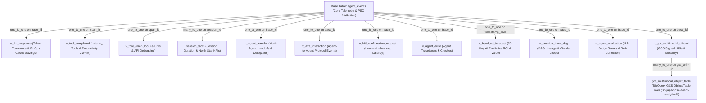

# Google Cloud PSO JAPAC — APO Agent Analytics Looker Block (`pso-agent-analytics-block`)

This Looker Block is the canonical analytics and BI engine for **Google Cloud PSO JAPAC — APO (Agent Program Office)** and **Enterprise Customer Deployments**. It integrates with Google ADK (`BigQueryAgentAnalyticsPlugin`) telemetry stored in Google Cloud BigQuery (`agent_events` table + 24 unnested flat views + External Object Tables) to deliver server-verified productivity attribution, 30-day predictive forecasting, multi-agent DAG lineage, LLM-as-a-Judge quality evaluation, full-stack observability, and executive reporting.

---

## Why This Looker Block Was Built: Solving the "Before" Problems

Before APO Analytics, engineering and consulting teams faced four systemic challenges:
1.  **Spreadsheets & Google Forms**: No system of record, no audit trail.
2.  **No Per-Agent Attribution**: No verifiable signal showing which agents create value.
3.  **No Common Identity Model**: The same agent was counted differently across projects.
4.  **No Real-Time Signal**: Expansion and staffing decisions were made on stale, manual data.

### Three Measurable Outcomes That Drove Our Design:
*   **1. Verifiable**: Hours-saved attributed to a specific agent, project, and engineer. Server-verified from BigQuery telemetry—not self-reported spreadsheets.
*   **2. Self-Service**: APO leads and engineering managers run their own reports across **5 Practice Areas** and **6 JAPAC Sub-Regions** without engineering tickets.
*   **3. Real-Time**: Week-over-week adoption, FinOps economics, and predictive forecasts updated live.

---

## Three Canonical Looker Dashboards & Key Features

This Looker Block includes three canonical dashboards capturing a total of **74 distinct analytical metrics and scorecards** across 13 BigQuery ADK telemetry domains:

*   **1. `pso_apo_executive_portal` (23 Executive Metrics)**: Server-Verified Hours Saved (`3.5h/session`), Consulting Value USD (`$350/hr` / `$2,800/day` PSO Consultant rate), 30-Day BQML AI Predictive ROI Forecast (with 90%/110% confidence bounds), Multi-Agent DAG Lineage, CI/CD SLA Gates, and Practice/Regional attributions.
*   **2. `agent_analytics_usage` (25 Usage Metrics)**: FinOps token economics (including **75% Gemini prompt cache discount** savings), session volume, trace counts, multi-agent handoffs, A2A protocol interactions, HITL confirmation requests, and GCS Multimodal Object Table offloading.
*   **3. `agent_analytics_performance` (26 Performance Metrics)**: P50/P75/P90/P99 latencies, reliability SLAs, LLM-as-a-Judge Quality Scores (0–100%), User Feedback Satisfaction %, Self-Correction Loops %, dedicated **AI Recommendations** tab (`AI.GENERATE` + empirical error diagnostics), Recommendation Provenance, and Enterprise Edge Cases.

> [!IMPORTANT]
> For the complete, authoritative catalog of all 74 metrics across all three dashboards—including BigQuery source fields, formulas, and derivation logic—see **[METRICS.md](METRICS.md)**.

### Enterprise BI Capabilities
*   **Looker Next-Gen Canvas**: All dashboards use Looker's responsive Next-Gen canvas (`preferred_viewer: dashboards-next`).
*   **Dynamic Cross-Filtering**: Enable interactive drill-downs across charts (`crossfilter_enabled: yes`).
*   **Universal Interactive Filters**: Standardized controls across all dashboards for **`Date Range`**, **`Practice Area`**, **`Sub-Region`**, **`Pilot Project`**, **`Agent Name`**, **`Trace ID`**, and **`Session ID`**.
*   **Standardized Executive 4-Part Hover Notes**: Every visual data tile features a plain-English hover explanation (`What | How | Why it matters | Drill`).

---

## Complete LookML Model Architecture & Join Graph

The `agent_events` explore (`explores/agent_events.explore.lkml`) serves as the relational semantic layer connecting raw BigQuery ADK telemetry to Looker dashboards. It joins the base `agent_events` table with specialized refined views, BigQuery AI forecasting derived tables, and BigQuery External Object Tables over GCS.

### Relational Join Topology



### Complete Explore Join Catalog

| LookML View Name | Join Type & Relationship | SQL Join Condition (`sql_on`) | Primary Analytical Domain & Key Measures |
| :--- | :--- | :--- | :--- |
| **`agent_events`** | *Base Table* | *N/A* | Core ADK telemetry, PSO attribution (`practice_area`, `sub_region`, `pilot_project`, `canonical_agent_name`), Server-Verified Hours Saved (`3.5h/session`), Consulting Value USD (`$350/hr` / `$2,800/day`), and CI/CD SLA Gates. |
| **`session_facts`** | `left_outer` (`many_to_one`) | `${agent_events.session_id} = ${session_facts.session_id}` | Session-level aggregation, conversational duration, and user stickiness. |
| **`v_llm_response`** | `left_outer` (`one_to_one`) | `${agent_events.trace_id} = ${v_llm_response.trace_id}` | FinOps token consumption, model tier distributions (`gemini-2.5-pro` vs. `gemini-2.5-flash`), 75% prompt cache discount savings, and P50/P75/P90/P99 LLM latency. |
| **`v_tool_completed`** | `left_outer` (`one_to_one`) | `${agent_events.span_id} = ${v_tool_completed.span_id}` | Tool execution counts, P50/P75/P90/P99 tool latency, and Tool Productivity Credit Hours (CWPM). |
| **`v_tool_error`** | `left_outer` (`one_to_one`) | `${agent_events.span_id} = ${v_tool_error.span_id}` | Tool execution failures, API error tracebacks, and error distributions. |
| **`v_agent_transfer`** | `left_outer` (`one_to_one`) | `${agent_events.trace_id} = ${v_agent_transfer.trace_id}` | Multi-agent delegation, supervisor-worker handoffs, and transfer frequency. |
| **`v_a2a_interaction`** | `left_outer` (`one_to_one`) | `${agent_events.trace_id} = ${v_a2a_interaction.trace_id}` | Decentralized Agent-to-Agent protocol interactions and communication volume. |
| **`v_hitl_confirmation_request`** | `left_outer` (`one_to_one`) | `${agent_events.trace_id} = ${v_hitl_confirmation_request.trace_id}` | Human-in-the-Loop confirmation volume and human approval latency bottlenecks. |
| **`v_agent_error`** | `left_outer` (`one_to_one`) | `${agent_events.trace_id} = ${v_agent_error.trace_id}` | Agent-level execution exceptions, crashes, and error rate SLA monitoring. |
| **`v_bqml_roi_forecast`** | `left_outer` (`one_to_one`) | `${agent_events.timestamp_date} = ${v_bqml_roi_forecast.forecast_date}` | BigQuery AI 30-day predictive forecasting of hours saved and consulting dollar value with 90%/110% confidence bounds. |
| **`v_session_trace_dag`** | `left_outer` (`one_to_one`) | `${agent_events.trace_id} = ${v_session_trace_dag.trace_id}` | Multi-agent DAG execution lineage (`from_agent -> to_target`) and A2A circular delegation ping-pong loop alerts. |
| **`v_agent_evaluation`** | `left_outer` (`one_to_one`) | `${agent_events.trace_id} = ${v_agent_evaluation.trace_id}` | LLM-as-a-Judge quality evaluation (0–100%), User Feedback Satisfaction Rate (%), Self-Correction loop recovery rates, and AI Model & Prompt Recommendations. |
| **`v_gcs_multimodal_offload`** | `left_outer` (`one_to_one`) | `${agent_events.trace_id} = ${v_gcs_multimodal_offload.trace_id}` | Extracted GCS signed object URIs and multimodal asset categorization (`IMAGE`, `DOCUMENT`, `AUDIO`, `VIDEO`, `LARGE_PAYLOAD_JSON`). |
| **`gcs_multimodal_object_table`** | `left_outer` (`many_to_one`) | `${v_gcs_multimodal_offload.gcs_uri} = ${gcs_multimodal_object_table.uri}` | External Object Table over `gs://japac-pso-agent-analytics/*`, tracking physical GCS storage bytes and file inventory. |

---

## Installation, BigQuery Setup & Looker Configuration

### 1. Clone this repository
```bash
git clone https://github.com/nikunjbhartia/pso-agent-analytics-block.git
cd pso-agent-analytics-block
```

### 2. Automated BigQuery Infrastructure Setup (`scripts/setup_all.sh`)
Deploy your BigQuery Cloud Resource Connection, GCS Multimodal Object Table, and AI Judge Recommendations table using our automated, parameterized deployment script:

```bash
export PROJECT_ID="your-project-id"
export DATASET_NAME="agent_analytics"
export LOCATION="asia-southeast1"
export CONNECTION_NAME="bqaa_ai_connection"
export GCS_BUCKET="japac-pso-agent-analytics"

./scripts/setup_all.sh
```
*   **What `setup_all.sh` automates in one step**:
    1.  Validates or creates BigQuery Cloud Resource Connection (`${CONNECTION_NAME}`) in `${LOCATION}`.
    2.  Deploys External Object Table `${PROJECT_ID}.${DATASET_NAME}.gcs_multimodal_object_table` over `gs://${GCS_BUCKET}/*`.
    3.  Creates `${PROJECT_ID}.${DATASET_NAME}.agent_judge_recommendations` table and runs initial `AI.GENERATE` MERGE scoring.
    4.  **Automatically registers a BigQuery Scheduled Query via Data Transfer Service to run `02_build_judge_recommendations_table.sql` every 15 minutes!**

### 3. Configure LookML Constants in `manifest.lkml`
Define your BigQuery connection name and dataset containing `agent_events`:
```lookml
constant: CONNECTION_NAME {
  value: "your_bigquery_connection_name"
}
constant: PROJECT_ID {
  value: "your_google_cloud_project_id"
}
constant: DATASET_NAME {
  value: "agent_analytics"
}
constant: TABLE_NAME {
  value: "agent_events"
}
```

### 4. Deploy Dashboards
Commit changes to your Looker Git repository and deploy to Production. All three dashboards will appear under LookML Dashboards with full interactive filters and 4-part hover explanations!
