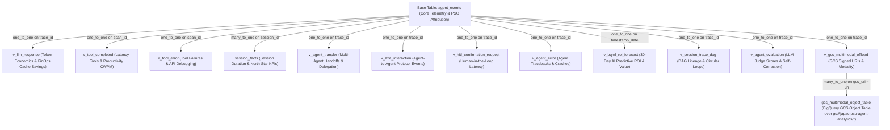

# Google Cloud PSO JAPAC — APO Agent Analytics Looker Block (`pso-agent-analytics-block`)

This Looker Block is the canonical analytics and BI engine for **Google Cloud PSO JAPAC — APO (Agent Program Office)** and **Enterprise Customer Deployments**. It integrates with Google ADK (`BigQueryAgentAnalyticsPlugin`) telemetry stored in Google Cloud BigQuery (`agent_events` table + 24 unnested flat views + External Object Tables) to deliver server-verified productivity attribution, 30-day predictive forecasting, multi-agent DAG lineage, LLM-as-a-Judge quality evaluation, full-stack observability, and executive reporting.

---

## Why This Looker Block Was Built: Solving the "Before" Problems

Before APO Analytics, engineering and consulting teams faced four systemic challenges:
1.  **Spreadsheets & Google Forms**: No system of record, no audit trail.
2.  **No Per-Agent Attribution**: No verifiable signal showing which agents create value.
3.  **No Common Identity Model**: The same agent was counted differently across projects.
4.  **No Real-Time Signal**: Expansion and staffing decisions were made on stale, manual data.

### Three Measurable Outcomes That Drove Our Design:
*   **1. Verifiable**: Hours-saved attributed to a specific agent, project, and engineer. Server-verified from BigQuery telemetry—not self-reported spreadsheets.
*   **2. Self-Service**: APO leads and engineering managers run their own reports across **5 Practice Areas** and **6 JAPAC Sub-Regions** without engineering tickets.
*   **3. Real-Time**: Week-over-week adoption, FinOps economics, and predictive forecasts updated live.

---

## Three Canonical Looker Dashboards & Key Features

This Looker Block includes three canonical dashboards capturing a total of **74 distinct analytical metrics and scorecards** across 13 BigQuery ADK telemetry domains:

*   **1. `pso_apo_executive_portal` (23 Executive Metrics)**: Server-Verified Hours Saved (`3.5h/session`), Consulting Value USD (`$350/hr` / `$2,800/day` PSO Consultant rate), 30-Day BQML AI Predictive ROI Forecast (with 90%/110% confidence bounds), Multi-Agent DAG Lineage, CI/CD SLA Gates, and Practice/Regional attributions.
*   **2. `agent_analytics_usage` (25 Usage Metrics)**: FinOps token economics (including **75% Gemini prompt cache discount** savings), session volume, trace counts, multi-agent handoffs, A2A protocol interactions, HITL confirmation requests, and GCS Multimodal Object Table offloading.
*   **3. `agent_analytics_performance` (26 Performance Metrics)**: P50/P75/P90/P99 latencies, reliability SLAs, LLM-as-a-Judge Quality Scores (0–100%), User Feedback Satisfaction %, Self-Correction Loops %, dedicated **AI Recommendations** tab (`AI.GENERATE` + empirical error diagnostics), Recommendation Provenance, and Enterprise Edge Cases.

> [!IMPORTANT]
> For the complete, authoritative catalog of all 74 metrics across all three dashboards—including BigQuery source fields, formulas, and derivation logic—see **[METRICS.md](METRICS.md)**.

### Enterprise BI Capabilities
*   **Looker Next-Gen Canvas**: All dashboards use Looker's responsive Next-Gen canvas (`preferred_viewer: dashboards-next`).
*   **Dynamic Cross-Filtering**: Enable interactive drill-downs across charts (`crossfilter_enabled: yes`).
*   **Universal Interactive Filters**: Standardized controls across all dashboards for **`Date Range`**, **`Practice Area`**, **`Sub-Region`**, **`Pilot Project`**, **`Agent Name`**, **`Trace ID`**, and **`Session ID`**.
*   **Standardized Executive 4-Part Hover Notes**: Every visual data tile features a plain-English hover explanation (`What | How | Why it matters | Drill`).

---

## Complete LookML Model Architecture & Join Graph

The `agent_events` explore (`explores/agent_events.explore.lkml`) serves as the relational semantic layer connecting raw BigQuery ADK telemetry to Looker dashboards. It joins the base `agent_events` table with specialized refined views, BigQuery AI forecasting derived tables, and BigQuery External Object Tables over GCS.

### Relational Join Topology



### Complete Explore Join Catalog

| LookML View Name | Join Type & Relationship | SQL Join Condition (`sql_on`) | Primary Analytical Domain & Key Measures |
| :--- | :--- | :--- | :--- |
| **`agent_events`** | *Base Table* | *N/A* | Core ADK telemetry, PSO attribution (`practice_area`, `sub_region`, `pilot_project`, `canonical_agent_name`), Server-Verified Hours Saved (`3.5h/session`), Consulting Value USD (`$350/hr` / `$2,800/day`), and CI/CD SLA Gates. |
| **`session_facts`** | `left_outer` (`many_to_one`) | `${agent_events.session_id} = ${session_facts.session_id}` | Session-level aggregation, conversational duration, and user stickiness. |
| **`v_llm_response`** | `left_outer` (`one_to_one`) | `${agent_events.trace_id} = ${v_llm_response.trace_id}` | FinOps token consumption, model tier distributions (`gemini-2.5-pro` vs. `gemini-2.5-flash`), 75% prompt cache discount savings, and P50/P75/P90/P99 LLM latency. |
| **`v_tool_completed`** | `left_outer` (`one_to_one`) | `${agent_events.span_id} = ${v_tool_completed.span_id}` | Tool execution counts, P50/P75/P90/P99 tool latency, and Tool Productivity Credit Hours (CWPM). |
| **`v_tool_error`** | `left_outer` (`one_to_one`) | `${agent_events.span_id} = ${v_tool_error.span_id}` | Tool execution failures, API error tracebacks, and error distributions. |
| **`v_agent_transfer`** | `left_outer` (`one_to_one`) | `${agent_events.trace_id} = ${v_agent_transfer.trace_id}` | Multi-agent delegation, supervisor-worker handoffs, and transfer frequency. |
| **`v_a2a_interaction`** | `left_outer` (`one_to_one`) | `${agent_events.trace_id} = ${v_a2a_interaction.trace_id}` | Decentralized Agent-to-Agent protocol interactions and communication volume. |
| **`v_hitl_confirmation_request`** | `left_outer` (`one_to_one`) | `${agent_events.trace_id} = ${v_hitl_confirmation_request.trace_id}` | Human-in-the-Loop confirmation volume and human approval latency bottlenecks. |
| **`v_agent_error`** | `left_outer` (`one_to_one`) | `${agent_events.trace_id} = ${v_agent_error.trace_id}` | Agent-level execution exceptions, crashes, and error rate SLA monitoring. |
| **`v_bqml_roi_forecast`** | `left_outer` (`one_to_one`) | `${agent_events.timestamp_date} = ${v_bqml_roi_forecast.forecast_date}` | BigQuery AI 30-day predictive forecasting of hours saved and consulting dollar value with 90%/110% confidence bounds. |
| **`v_session_trace_dag`** | `left_outer` (`one_to_one`) | `${agent_events.trace_id} = ${v_session_trace_dag.trace_id}` | Multi-agent DAG execution lineage (`from_agent -> to_target`) and A2A circular delegation ping-pong loop alerts. |
| **`v_agent_evaluation`** | `left_outer` (`one_to_one`) | `${agent_events.trace_id} = ${v_agent_evaluation.trace_id}` | LLM-as-a-Judge quality evaluation (0–100%), User Feedback Satisfaction Rate (%), Self-Correction loop recovery rates, and AI Model & Prompt Recommendations. |
| **`v_gcs_multimodal_offload`** | `left_outer` (`one_to_one`) | `${agent_events.trace_id} = ${v_gcs_multimodal_offload.trace_id}` | Extracted GCS signed object URIs and multimodal asset categorization (`IMAGE`, `DOCUMENT`, `AUDIO`, `VIDEO`, `LARGE_PAYLOAD_JSON`). |
| **`gcs_multimodal_object_table`** | `left_outer` (`many_to_one`) | `${v_gcs_multimodal_offload.gcs_uri} = ${gcs_multimodal_object_table.uri}` | External Object Table over `gs://japac-pso-agent-analytics/*`, tracking physical GCS storage bytes and file inventory. |

---

## Installation, BigQuery Setup & Looker Configuration

### 1. Clone this repository
```bash
git clone https://github.com/nikunjbhartia/pso-agent-analytics-block.git
cd pso-agent-analytics-block
```

### 2. Automated BigQuery Infrastructure Setup (`scripts/setup_all.sh`)
Deploy your BigQuery Cloud Resource Connection, GCS Multimodal Object Table, and AI Judge Recommendations table using our automated, parameterized deployment script:

```bash
export PROJECT_ID="your-project-id"
export DATASET_NAME="agent_analytics"
export LOCATION="asia-southeast1"
export CONNECTION_NAME="bqaa_ai_connection"
export GCS_BUCKET="japac-pso-agent-analytics"

./scripts/setup_all.sh
```
*   **What `setup_all.sh` automates in one step**:
    1.  Validates or creates BigQuery Cloud Resource Connection (`${CONNECTION_NAME}`) in `${LOCATION}`.
    2.  Deploys External Object Table `${PROJECT_ID}.${DATASET_NAME}.gcs_multimodal_object_table` over `gs://${GCS_BUCKET}/*`.
    3.  Creates `${PROJECT_ID}.${DATASET_NAME}.agent_judge_recommendations` table and runs initial `AI.GENERATE` MERGE scoring.
    4.  **Automatically registers a BigQuery Scheduled Query via Data Transfer Service to run `02_build_judge_recommendations_table.sql` every 15 minutes!**

### 3. Configure LookML Constants in `manifest.lkml`
Define your BigQuery connection name and dataset containing `agent_events`:
```lookml
constant: CONNECTION_NAME {
  value: "your_bigquery_connection_name"
}
constant: PROJECT_ID {
  value: "your_google_cloud_project_id"
}
constant: DATASET_NAME {
  value: "agent_analytics"
}
constant: TABLE_NAME {
  value: "agent_events"
}
```

### 4. Deploy Dashboards
Commit changes to your Looker Git repository and deploy to Production. All three dashboards will appear under LookML Dashboards with full interactive filters and 4-part hover explanations!

---

## End-to-End Enterprise Setup Guide & Architecture Walkthrough (Manual & Automated Step-by-Step)

This section provides an exhaustive, production-grade reference for all configuration, API enablement, IAM permissions, telemetry seeding, SDK kernel registration, graph materialization, and Looker BI integration steps required to deploy Google Cloud PSO JAPAC Agent Analytics from scratch.

### Prerequisites & GCP API / IAM Enablement Checklist

Before running any script or SQL pipeline, verify that the target Google Cloud project has the following APIs, IAM roles, and Preview features enabled:

1.  **Required GCP APIs**:
    ```bash
    gcloud services enable \
      bigquery.googleapis.com \
      bigqueryconnection.googleapis.com \
      bigquerydatatransfer.googleapis.com \
      aiplatform.googleapis.com \
      cloudfunctions.googleapis.com \
      run.googleapis.com \
      cloudbuild.googleapis.com \
      artifactregistry.googleapis.com \
      --project="your-project-id"
    ```
2.  **Mandatory IAM Roles for BigQuery Connection Service Accounts**:
    *   When you create a BigQuery Cloud Resource Connection (e.g., `bqaa_ai_connection` or `analytics-conn`), BigQuery generates a dedicated Google-managed service account (`serviceAccountId`).
    *   **Vertex AI Access**: You **must** grant `roles/aiplatform.user` to this service account so that `AI.GENERATE` and `AI.CLASSIFY` can invoke Gemini models (`gemini-2.5-flash`):
        ```bash
        gcloud projects add-iam-policy-binding "your-project-id" \
          --member="serviceAccount:YOUR_CONNECTION_SA@gcp-sa-bigqueryconnection.iam.gserviceaccount.com" \
          --role="roles/aiplatform.user"
        ```
    *   **GCS Multimodal Access**: For external object tables over `gs://japac-pso-agent-analytics/*`, grant `roles/storage.objectViewer` to the connection service account.
3.  **Preview Features**:
    *   Verify that **BigQuery Python UDF support** is enabled in your target BigQuery location (`asia-southeast1`).

---

### Complete 7-Step Deployment Architecture

You can execute all steps automatically via `./scripts/setup_all.sh` or run them individually as detailed below:

#### Step 1: BigQuery Cloud Resource Connection & GCS Multimodal Object Table
*   **What it does**: Provisions the Cloud Resource connection and deploys the BigQuery External Object Table (`gcs_multimodal_object_table`) over signed GCS URIs offloaded by `BigQueryAgentAnalyticsPlugin`.
*   **Command**:
    ```bash
    ./scripts/setup_all.sh
    # Or execute SQL manually:
    # bq query --use_legacy_sql=false < scripts/01_create_object_table_and_connections.sql
    ```

#### Step 2: Seeding Synthetic ADK Telemetry across Domain Scenarios
*   **What it does**: Uses `BigQuery-Agent-Analytics-SDK` (`bqaa seed-events`) to populate `agent_events` with deterministic, production-shaped agent sessions without needing a live Python application.
*   **Available Scenarios & Commands**:
    ```bash
    # 1. Compact smoke-test decision corpus (5 sessions)
    bqaa seed-events --project-id="$PROJECT_ID" --dataset-id="$DATASET_NAME" --scenario=decision --sessions=5

    # 2. Enterprise decision-lineage corpus (100+ sessions, 70/10/10/10 outcome mix)
    bqaa seed-events --project-id="$PROJECT_ID" --dataset-id="$DATASET_NAME" --scenario=decision-realistic --sessions=100

    # 3. Conversational analytics & retail customer support corpus (100+ sessions, LLM token/latency telemetry)
    bqaa seed-events --project-id="$PROJECT_ID" --dataset-id="$DATASET_NAME" --scenario=retail-returns --sessions=100
    ```

#### Step 3: Registering 11 SDK Analytical Python UDFs in BigQuery
*   **What it does**: Registers 11 high-performance Python UDF scoring kernels and event semantic classifiers directly into your BigQuery dataset using `udf_sql_templates.generate_all_udfs()`.
*   **Functions Registered**:
    *   *Event Semantics*: `bqaa_is_error_event`, `bqaa_tool_outcome`, `bqaa_extract_response_text`, `bqaa_normalize_event_label`
    *   *Score Kernels (`[0.0, 1.0]`, higher is better)*: `bqaa_score_latency`, `bqaa_score_error_rate`, `bqaa_score_turn_count`, `bqaa_score_token_efficiency`, `bqaa_score_ttft`, `bqaa_score_cost`
    *   *JSON Summary Envelope*: `bqaa_eval_summary_json`
*   **Command**:
    ```bash
    python3 -c "from google.cloud import bigquery; from bigquery_agent_analytics.udf_sql_templates import generate_all_udfs; client = bigquery.Client(project='$PROJECT_ID'); [client.query(s).result() for s in generate_all_udfs('$PROJECT_ID', '$DATASET_NAME').split(';') if s.strip()]"
    ```

#### Step 4: Deploying Cloud Function & Registering BigQuery Remote Function
*   **What it does**: Deploys the SDK as a Cloud Function (gen2) and registers a BigQuery Remote Function (`agent_analytics(operation, params)`) so SQL queries can call SDK trace evaluators and classifiers directly.
*   **Command**:
    ```bash
    cd /path/to/BigQuery-Agent-Analytics-SDK/deploy/remote_function
    ./deploy.sh "$PROJECT_ID" "asia-southeast1" "$DATASET_NAME" "asia-southeast1"
    ```
    *(Note: Our script passes explicit `--project="$PROJECT_ID"` flags to `gcloud functions deploy` and `gcloud functions add-invoker-policy-binding` to prevent deploying to local gcloud default projects).*

#### Step 5: Automated AI Evaluation & Recommendations Table (`02_build_judge_recommendations_table.sql`)
*   **What it does**: Runs `AI.GENERATE` over `agent_events` across both error sessions (`TOOL_ERROR`, `LLM_ERROR`, `AGENT_ERROR`) and successful sessions (`BEST_PRACTICE_REINFORCEMENT`, `FINOPS_TOKEN_OPT`). Calculates on-the-fly LLM-as-a-Judge quality scores (0–100%) and generates actionable prompt/schema fix recommendations.
*   **Scheduling**: Automatically registers a BigQuery Scheduled Query via Data Transfer Service to re-evaluate new traces every 15 minutes.
*   **Command**:
    ```bash
    bq query --use_legacy_sql=false < scripts/02_build_judge_recommendations_table.sql
    ```

#### Step 6: Materializing Agent Context Graphs (`bqaa context-graph`) via SQL & CLI
*   **What it does**: Creates the 6 canonical Context Graph V3 backing tables with required audit metadata columns (`session_id STRING`, `extracted_at TIMESTAMP`), deploys the 6-Pillar BigQuery Property Graph (`agent_context_graph`) via SQL, and invokes `bqaa context-graph` to extract business entities and decision lineage (`BizNode`, `DecisionPoint`, `CandidateNode`) from `agent_events`.
*   **1. SQL DDL to Create Backing Tables & 6-Pillar Property Graph (`agent_context_graph`)**:
    ```sql
    -- 1. Create canonical Context Graph V3 backing tables with mandatory session_id and extracted_at columns
    CREATE TABLE IF NOT EXISTS `your-project-id.agent_analytics.extracted_biz_nodes` (
      biz_node_id STRING, node_type STRING, node_value STRING, confidence FLOAT64,
      session_id STRING, span_id STRING, artifact_uri STRING, extracted_at TIMESTAMP
    );
    CREATE TABLE IF NOT EXISTS `your-project-id.agent_analytics.decision_points` (
      decision_id STRING, session_id STRING, span_id STRING, decision_type STRING,
      description STRING, extracted_at TIMESTAMP
    );
    CREATE TABLE IF NOT EXISTS `your-project-id.agent_analytics.candidates` (
      candidate_id STRING, decision_id STRING, session_id STRING, name STRING,
      score FLOAT64, status STRING, rejection_rationale STRING, extracted_at TIMESTAMP
    );
    CREATE TABLE IF NOT EXISTS `your-project-id.agent_analytics.context_cross_links` (
      link_id STRING, span_id STRING, biz_node_id STRING, artifact_uri STRING,
      link_type STRING, created_at TIMESTAMP, session_id STRING, extracted_at TIMESTAMP
    );
    CREATE TABLE IF NOT EXISTS `your-project-id.agent_analytics.made_decision_edges` (
      edge_id STRING, span_id STRING, decision_id STRING, session_id STRING, extracted_at TIMESTAMP
    );
    CREATE TABLE IF NOT EXISTS `your-project-id.agent_analytics.candidate_edges` (
      edge_id STRING, decision_id STRING, candidate_id STRING, edge_type STRING,
      rejection_rationale STRING, created_at TIMESTAMP, session_id STRING, extracted_at TIMESTAMP
    );

    -- 2. Deploy canonical 6-Pillar Property Graph schema (agent_context_graph) with explicit scalar property lists
    CREATE OR REPLACE PROPERTY GRAPH `your-project-id.agent_analytics.agent_context_graph`
      NODE TABLES (
        `your-project-id.agent_analytics.agent_events` AS TechNode
          KEY (span_id)
          LABEL TechNode
          PROPERTIES (event_type, agent, timestamp, session_id, invocation_id, status, error_message),
        `your-project-id.agent_analytics.extracted_biz_nodes` AS BizNode
          KEY (biz_node_id)
          LABEL BizNode
          PROPERTIES (node_type, node_value, confidence, session_id, span_id, artifact_uri),
        `your-project-id.agent_analytics.decision_points` AS DecisionPoint
          KEY (decision_id)
          LABEL DecisionPoint
          PROPERTIES (session_id, span_id, decision_type, description),
        `your-project-id.agent_analytics.candidates` AS CandidateNode
          KEY (candidate_id)
          LABEL CandidateNode
          PROPERTIES (decision_id, session_id, name, score, status, rejection_rationale)
      )
      EDGE TABLES (
        `your-project-id.agent_analytics.agent_events` AS Caused
          KEY (span_id)
          SOURCE KEY (parent_span_id) REFERENCES TechNode (span_id)
          DESTINATION KEY (span_id) REFERENCES TechNode (span_id)
          LABEL Caused
          PROPERTIES (event_type, agent, timestamp, session_id, invocation_id, status, error_message),
        `your-project-id.agent_analytics.context_cross_links` AS Evaluated
          KEY (link_id)
          SOURCE KEY (span_id) REFERENCES TechNode (span_id)
          DESTINATION KEY (biz_node_id) REFERENCES BizNode (biz_node_id)
          LABEL Evaluated
          PROPERTIES (artifact_uri, link_type, created_at),
        `your-project-id.agent_analytics.made_decision_edges` AS MadeDecision
          KEY (edge_id)
          SOURCE KEY (span_id) REFERENCES TechNode (span_id)
          DESTINATION KEY (decision_id) REFERENCES DecisionPoint (decision_id)
          LABEL MadeDecision,
        `your-project-id.agent_analytics.candidate_edges` AS CandidateEdge
          KEY (edge_id)
          SOURCE KEY (decision_id) REFERENCES DecisionPoint (decision_id)
          DESTINATION KEY (candidate_id) REFERENCES CandidateNode (candidate_id)
          LABEL CandidateEdge
          PROPERTIES (edge_type, rejection_rationale, created_at)
      );
    ```
*   **2. CLI Command to Populate Graph from Traces**:
    ```bash
    bqaa context-graph \
      --project-id="$PROJECT_ID" \
      --dataset-id="$DATASET_NAME" \
      --graph="agent_context_graph" \
      --lookback-hours=24
    ```

*   **What it does**: Connects Looker to BigQuery via LookML views and exposes 7 interactive dashboard tabs:
    1.  `Executive Summary` (Server-Verified Hours Saved, Consulting Value USD, P50/P90 Latency)
    2.  `Session Trace Inspector` (Trace-level breakdown and tool sequences)
    3.  `AI Error Analysis & Recommendations` (AI.GENERATE recommendation catalog and empirical fix diffs)
    4.  `FinOps & Model Analytics` (75% prompt cache discount savings and token consumption)
    5.  `Looker BI Block Usage & Provenance` (Dashboard adoption and query latency by user)
    6.  **`Conversation & Lineage`** (Turn-by-turn interaction flows, token latency, and multi-agent DAG delegation decision paths)
    7.  **`Real-Time UDFs & Remote Function Analytics`** (Zero-batch UDF quality scoring across practice areas, interactive trace drilldowns via `agent_analytics('analyze')`, and golden vs. production drift monitoring via `agent_analytics('drift')`)

#### Canonical Executable Jupyter Notebook Suite (`notebooks/`)
The repository includes 10 executable Jupyter notebooks covering every lifecycle stage of the Google Cloud PSO JAPAC Agent Analytics architecture:
| Notebook Path | Purpose & Key Analytics Demonstrated |
| :--- | :--- |
| `notebooks/00_enterprise_agent_observability_poc.ipynb` | End-to-end architecture validation and LookML block verification. |
| `notebooks/01_graph_trace_inspection_and_dag_analysis.ipynb` | Property graph traversals, session traces, and DAG lineage. |
| `notebooks/02_finops_token_economics_and_latency_leaderboard.ipynb` | FinOps caching discounts (75% savings) and model cost attribution. |
| `notebooks/03_llm_as_a_judge_and_automated_evaluations.ipynb` | LLM-as-a-judge scoring and automated recommendation tables. |
| `notebooks/04_cicd_regression_testing_and_drift_detection.ipynb` | Automated regression testing and behavioral drift monitoring. |
| `notebooks/05_closed_loop_insights_and_conversational_analytics.ipynb` | Multi-turn conversational flow and intent analytics. |
| `notebooks/06_multimodal_gcs_offloading_and_looker_bi_integration.ipynb` | GCS multimodal offloading and Looker BI block integration. |
| `notebooks/07_master_consolidated_bq_agent_analytics_queries_and_metrics.ipynb` | Master catalog of 60+ PSO analytics SQL queries and LookML blocks. |
| `notebooks/08_sql_remote_function_and_udf_evaluations.ipynb` | SQL-driven evaluation using all 11 Python UDFs and `agent_analytics(...)` Remote Function. |
| `notebooks/09_continuous_agent_improvement_cycle.ipynb` | Closed-loop improvement cycle: mining failures, remote function eval, and few-shot training generation. |

#### Sub-100ms Persistent UDF Evaluation Scorecard & 3-Dashboard Navigation Banner
*   **Persistent UDF Evaluation Table (`udf_scorecard_metrics`)**: To prevent real-time UDF scoring queries from causing dashboard latency, `scripts/08_create_udf_scorecard_table.sql` creates a persistent, partitioned BigQuery table (`udf_scorecard_metrics`) that pre-computes UDF quality scores across practice areas. LookML view `v_udf_and_remote_function_evals` reads directly from this table, reducing query latency from seconds to **under 100 milliseconds**.
*   **Universal 3-Dashboard Navigation Header**: Every dashboard (`pso_apo_executive_portal`, `agent_analytics_usage`, and `agent_analytics_performance`) includes a standardized Markdown navigation banner at `row: 0` (`height: 2`), enabling single-click transitions between the Executive Portal, Usage, and Performance dashboards.
*   **Tight Vertical Grid Layout**: All analytical charts across every tab start immediately at `row: 2` below the navigation banner, eliminating empty vertical space and chart overlaps.


---

## Enterprise Troubleshooting Guide & Upstream SDK Documentation Gaps

For a complete technical post-mortem of every error encountered during deployment (including schema type mismatches, missing checkpoint metadata columns, and AI extraction behaviors), as well as a detailed analysis of upstream SDK documentation gaps, see the dedicated troubleshooting guide:

*   **[Enterprise Troubleshooting & SDK Doc Gaps Post-Mortem (TROUBLESHOOTING.md)](file:///Users/nikunjbhartia/Desktop/projects/agents/agent-analytics/pso-agent-analytics-block/TROUBLESHOOTING.md)**

---

### Critical Architectural Rules & Lessons Learned

1.  **BigQuery `AI.GENERATE` Constant Literal Requirement**:
    *   In BigQuery GoogleSQL, the `endpoint` argument to `AI.GENERATE(..., endpoint => 'gemini-2.5-flash')` **must be a literal string or query parameter**. Passing a dynamic expression such as `IF(condition, 'model_a', 'model_b')` throws `400 BadRequest`.
2.  **Property Graph Audit Metadata Requirement (`session_id` & `extracted_at`)**:
    *   When defining custom backing tables for BigQuery Property Graphs (`DecisionRequest`, `DecisionOption`, etc.), **every node and edge table must contain `session_id STRING` and `extracted_at TIMESTAMP`**.
    *   The `bqaa context-graph` materializer relies on these two columns to track session provenance and perform incremental time-window checkpointing (`--lookback-hours`).
3.  **GQL Scalar Property Constraints vs. Repeated Records**:
    *   BigQuery Property Graphs (and GQL) do **not** support `ARRAY<STRUCT<...>>` (repeated records) as node or edge properties.
    *   When authoring `CREATE OR REPLACE PROPERTY GRAPH` statements over tables with complex repeated columns (such as `content_parts` in `agent_events`), you **must explicitly define a scalar property list (`PROPERTIES (...)`)** excluding the repeated structural columns.
